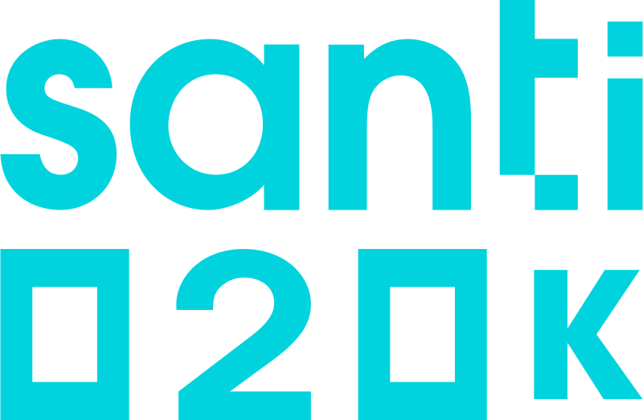
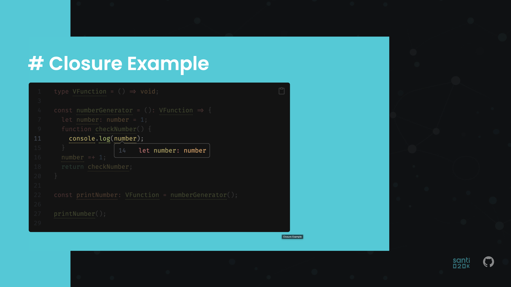

# Technical Interviews in React

Join us for an engaging meetup where we'll delve into the intriguing realm of technical
interviews within the React ecosystem! In this interactive talk, we'll tackle common
questions that often arise during technical interviews for React-related positions.
We'll share experiences, practical strategies, and tips to excel in these processes
and propel your career forward as a React developer.

## Run Locally

Clone the project

```bash
  git clone git@github.com:santi020k/interviews.git
```

Go to the project directory

```bash
  cd interviews
```

Install dependencies

```bash
  npm install
```

Start the server

```bash
  npm run dev
```

## Deployment

To deploy this project run

```bash
  npm run build
```

## Demo



## Authors

- [@santi020k](https://www.github.com/santi020k)

### 🚀 About Me
I'm a seasoned Full Stack Developer with a strong focus on front-end development
and a passion for leading tech teams to success. With over a decade of professional
experience, I've mastered complex technologies and led teams to deliver high-quality
solutions that align with business objectives. As a Tech Lead, I excel in crafting
technology around the core business model, ensuring project success and exceeding
expectations.

## Documentation

[Documentation](https://sli.dev/)
